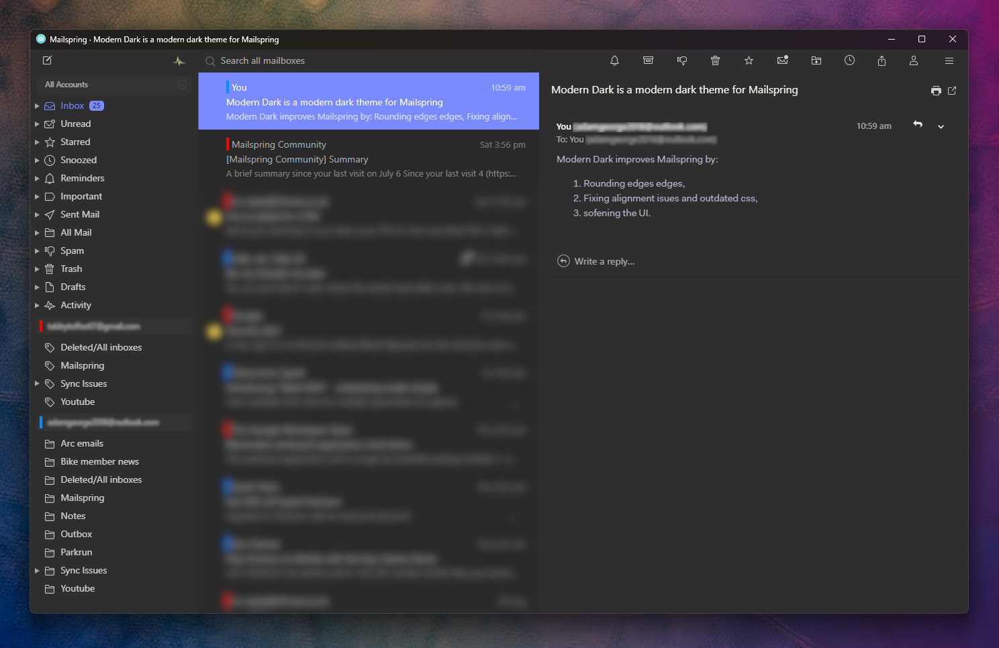

# Mailspring Modern Dark Theme

An elegant and modern dark theme for the [Mailspring](http://www.getmailspring.com/) email client.

## Improvements:

1. Rounded edges soften the UI,
2. Fixing alignment isues and bad css practices,
3. sofening the UI.

## Instalation

1. [Download the latest release here](https://github.com/TabbyToffee/mailspring-modern-dark/releases)

2. Open Mailspring.

3. Open the hamburger menu in the top-right.

4. Select `Install Theme...`

5. Select the `mailspring-modern-dark` folder.

6. Enjoy!
